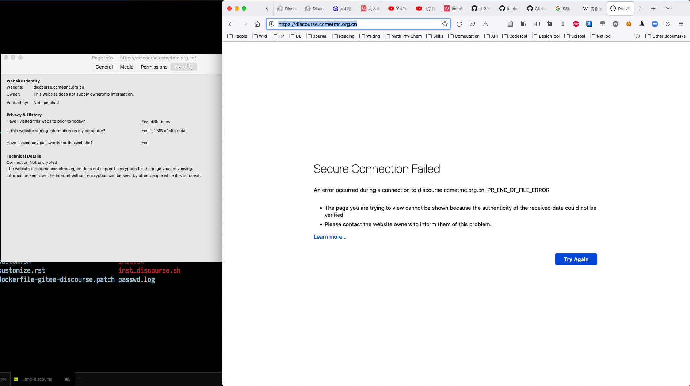

服务器配置
==========

自动构建脚本
------------

数据库备份
----------

参考 `Advanced, manual method of manually creating and restoring Discourse backups <https://meta.discourse.org/t/advanced-manual-method-of-manually-creating-and-restoring-discourse-backups/18273>`_.

注: 这个页面信息上存在不少问题, 比如把 ``/var/discourse`` 写成了 ``/var/docker/``.
在运行他给出的步骤时, /shared/ 下的文件总是 Permission denied. 因此还没能通过这种方法实现备份.
现在通过网页方式 /admin/backups 备份.

1. 进入旧的 Discourse Docker 容器::

   cd /var/discourse
   git pull
   ./launcher enter app
   su - discourse

2. 导出数据库和用户上传的文件::

   pg_dump -xOf discourse-backup.sql -d discourse -n public
   gzip -9 discourse-backup.sql
   tar -czf discourse-uploads.tar.gz -C /var/www/discourse/public/uploads

3. 两次 exit 退出容器, 将  ``/var/docker/shared/standalone`` 下的 ``discourse-uploads.tar.gz`` 和 ``discourse-backup.sql.gz`` 保存到其他地方.
   后者包含密码信息, 勿将其作未加密分享.

网页上设置好自动备份后, 所有备份会被保存在 ``/var/disourse/shared/standalone/backups/default`` 里, 直接从那里 ``scp`` 即可.

官方的关于命令行的说明: `Backup discourse from the command line <https://meta.discourse.org/t/restore-a-backup-from-command-line/108034>`_

从备份恢复
----------

通常来说, 更新 Discourse 本体前先备份数据. 然后重做一个空白的使用最新 Discourse 的容器, 然后从备份回档. 备份恢复同样参考官方说明: `Backup discourse from the command line <https://meta.discourse.org/t/restore-a-backup-from-command-line/108034>`_

SSL 设置
--------

Discourse 提供了 Let's Encrypt 作为免费的 SSL 方案, 但是在 rebuild 过程中我经常会遇到拉取 LE 所依赖的 acme.sh 失败, 导致前面整个过程白搭, 令人郁闷. 于是考虑用腾讯云域名本身提供的 TrustAsia TLS RSA CA 一年证书. 帮助教程: `Discourse 如何不使用 Let’s Encrypt 而使用 CA 签名的密钥进行安装 <https://www.ossez.com/t/discourse-lets-encrypt-ca/552>`_

签发单独的 ``discourse.ccmetmc.org.cn`` 域名, 在用 Firefox 登录时出现 Secure Connection Failed (下图).

